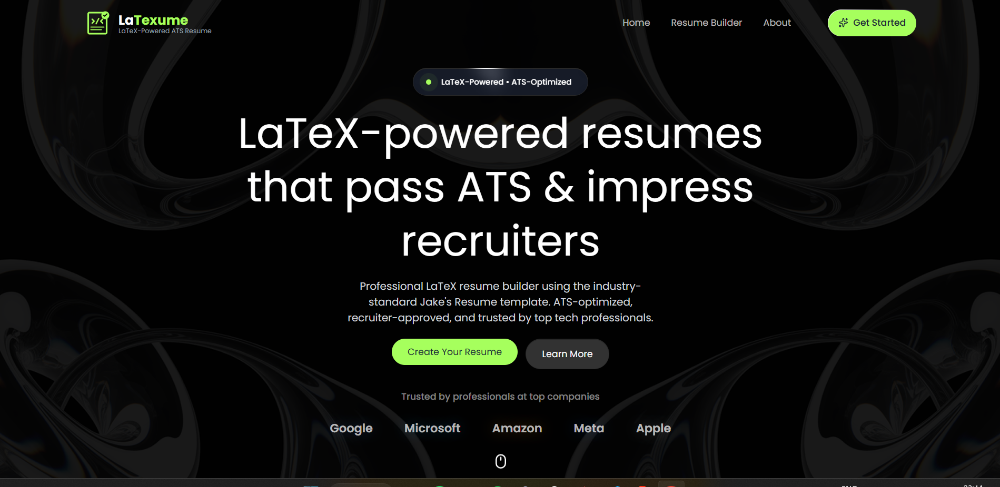
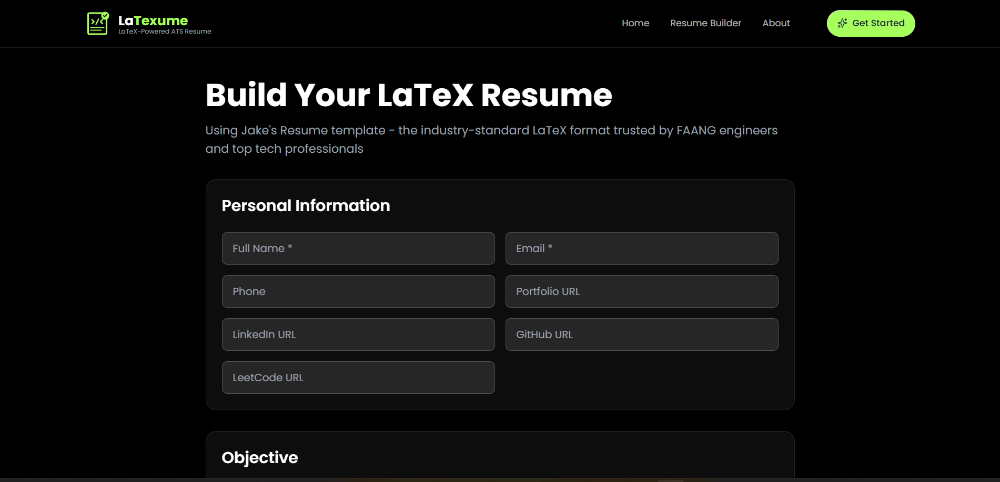
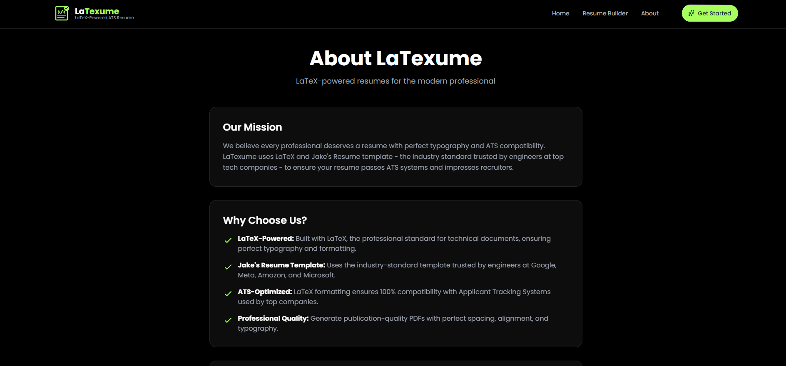
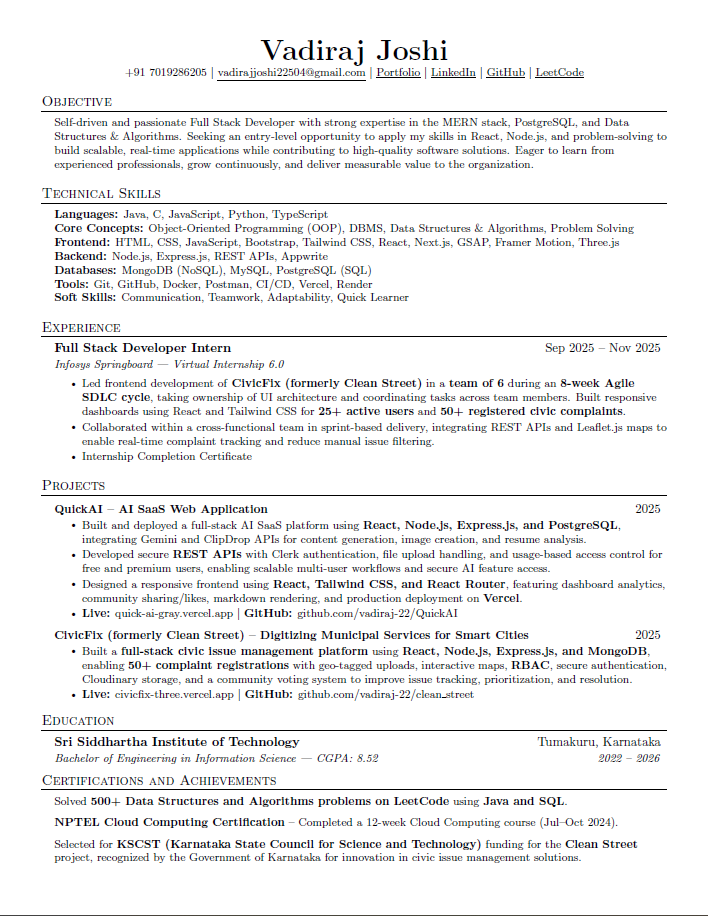

<div align="center">

#  LaTexume

### LaTeX-Powered ATS Resume Builder

*Where Code Meets Career*

[](https://reactjs.org/)
[](https://nodejs.org/)
[](https://www.latex-project.org/)
[](https://tailwindcss.com/)

[🚀 Live Site](https://latexume.vercel.app/) • [📖 Documentation](#usage) • [🐛 Report Bug](../../issues) • [✨ Request Feature](../../issues)


</div>

---

## 📋 Table of Contents

- [About](#-about)
- [Features](#-features)
- [Screenshots](#-screenshots)
- [Tech Stack](#-tech-stack)
- [Getting Started](#-getting-started)
- [Usage](#-usage)
- [Project Structure](#-project-structure)
- [API Documentation](#-api-documentation)
- [Contributing](#-contributing)
- [License](#-license)
- [Acknowledgments](#-acknowledgments)

---

## 🎯 About

**LaTexume** is a modern, professional resume builder that leverages the power of LaTeX to create ATS-optimized resumes. Built specifically for developers, engineers, and tech professionals, it uses the industry-standard **Jake's Resume template** - trusted by engineers at Google, Meta, Amazon, and Microsoft.

### Why LaTexume?

- ✅ **100% ATS Compatible** - LaTeX formatting ensures perfect parsing by all Applicant Tracking Systems
- ✅ **Industry Standard** - Uses Jake's Resume template, the most popular format among FAANG engineers
- ✅ **Professional Typography** - LaTeX provides publication-quality formatting
- ✅ **Zero LaTeX Knowledge Required** - Simple form-based interface
- ✅ **Instant PDF Generation** - Get your resume in seconds
- ✅ **Clickable Links** - Portfolio, GitHub, LinkedIn, and project links work in the PDF

---

## ✨ Features

<div align="center">

| Feature | Description |
|---------|-------------|
| 🎨 **LaTeX-Powered** | Professional document preparation system ensuring perfect typography |
| 🤖 **ATS-Optimized** | Guaranteed compatibility with all Applicant Tracking Systems |
| ⚡ **Instant Export** | Generate publication-quality PDFs in seconds |
| 🔗 **Smart Links** | All URLs are clickable in the generated PDF |
| 📱 **Responsive UI** | Beautiful interface that works on all devices |
| 🎯 **Structured Sections** | Organized format with all essential resume sections |
| 🌐 **Professional Links** | Add Portfolio, LinkedIn, GitHub, LeetCode profiles |
| 💼 **Project Showcase** | Include live site and GitHub repository links |
| 🏆 **Achievements** | Dedicated section for certifications and awards |

</div>

---

## 📸 Screenshots

<div align="center">

### 🏠 Home Page


*Modern landing page with resume structure preview*

---

### 📝 Resume Builder


*Intuitive form-based interface for entering your information*

---

### ℹ️ About Page


*Learn about LaTexume and Jake's Resume template*

---

### 📄 Generated Resume Preview


*Professional LaTeX-formatted resume output*

</div>

---

## 🛠️ Tech Stack

### Frontend
```
React 18.3          - Modern UI library with hooks
Vite 5.1           - Next-generation frontend tooling
Tailwind CSS 3.4   - Utility-first CSS framework
React Router 6.22  - Declarative routing for React
```

### Backend
```
Node.js            - JavaScript runtime
Express 5.2        - Fast, minimalist web framework
LaTeX              - Document preparation system
CORS               - Cross-Origin Resource Sharing
```

### Template
```
Jake's Resume      - Industry-standard LaTeX template
                    Trusted by FAANG engineers
```

---

## 🚀 Getting Started

### Prerequisites

Before you begin, ensure you have the following installed:

- **Node.js** (v16 or higher) - [Download](https://nodejs.org/)
- **npm** or **yarn** - Comes with Node.js
- **LaTeX Distribution** - Required for PDF generation
  - **Windows**: [MiKTeX](https://miktex.org/) or [TeX Live](https://www.tug.org/texlive/)
  - **macOS**: [MacTeX](https://www.tug.org/mactex/)
  - **Linux**: `sudo apt-get install texlive-full` (Ubuntu/Debian)

### Installation

1. **Clone the repository**
   ```bash
   git clone https://github.com/yourusername/latexume.git
   cd latexume
   ```

2. **Install Backend Dependencies**
   ```bash
   cd Server
   npm install
   ```

3. **Install Frontend Dependencies**
   ```bash
   cd ../Client
   npm install
   ```

4. **Start the Backend Server**
   ```bash
   cd ../Server
   npm run dev
   ```
   🟢 Backend runs on `http://localhost:3001`

5. **Start the Frontend (in a new terminal)**
   ```bash
   cd Client
   npm run dev
   ```
   🟢 Frontend runs on `http://localhost:5173`

6. **Open your browser**
   ```
   Navigate to http://localhost:5173
   ```

---

## 📖 Usage

### Step-by-Step Guide

1. **Personal Information**
   - Enter your name, email, phone number
   - Add professional links (Portfolio, LinkedIn, GitHub, LeetCode)

2. **Career Objective**
   - Write a brief professional summary
   - Highlight your key strengths and goals

3. **Technical Skills**
   - Organize skills by categories (Languages, Frameworks, Tools, etc.)
   - Example: `Languages: JavaScript, Python, Java`

4. **Work Experience**
   - Add job title, company, location, and dates
   - Include bullet points for achievements and responsibilities
   - Use action verbs and quantify results

5. **Projects**
   - List personal or academic projects
   - Specify technologies used
   - Add live site and GitHub repository links

6. **Education**
   - Institution name and location
   - Degree and field of study
   - Dates attended

7. **Certifications & Achievements**
   - Add as simple bullet points
   - Include certification name, organization, and date

8. **Generate PDF**
   - Click "Generate Resume PDF"
   - Your professionally formatted resume downloads instantly!

---

## 📁 Project Structure

```
latexume/
│
├── Client/                          # Frontend React Application
│   ├── public/                      # Static assets
│   │   └── resume-preview.png       # Resume preview image
│   │
│   ├── src/
│   │   ├── components/              # Reusable UI components
│   │   │   ├── Navbar.jsx          # Navigation bar
│   │   │   ├── Hero.jsx            # Hero section
│   │   │   ├── Features.jsx        # Features showcase
│   │   │   ├── ResumePreview.jsx   # Resume structure preview
│   │   │   ├── Footer.jsx          # Footer component
│   │   │   ├── Logo.jsx            # LaTexume logo
│   │   │   ├── ScrollDown.jsx      # Scroll indicator
│   │   │   └── TrustedBy.jsx       # Company logos
│   │   │
│   │   ├── pages/                   # Page components
│   │   │   ├── Home.jsx            # Landing page
│   │   │   ├── Builder.jsx         # Resume builder form
│   │   │   └── About.jsx           # About page
│   │   │
│   │   ├── App.jsx                  # Main app component
│   │   ├── main.jsx                 # Entry point
│   │   └── index.css                # Global styles
│   │
│   ├── index.html                   # HTML template
│   ├── package.json                 # Frontend dependencies
│   ├── vite.config.js              # Vite configuration
│   ├── tailwind.config.js          # Tailwind configuration
│   └── postcss.config.js           # PostCSS configuration
│
├── Server/                          # Backend Node.js Application
│   ├── lib/                         # Core functionality
│   │   ├── compiler.js             # LaTeX to PDF compilation
│   │   ├── latexEscape.js          # LaTeX special character escaping
│   │   └── templateEngine.js       # Template processing engine
│   │
│   ├── routes/                      # API routes
│   │   └── generateResume.js       # Resume generation endpoint
│   │
│   ├── templates/                   # LaTeX templates
│   │   └── jake.tex.js             # Jake's Resume template
│   │
│   ├── index.js                     # Server entry point
│   └── package.json                 # Backend dependencies
│
├── screenshots/                     # Application screenshots
│   ├── home.png
│   ├── builder.png
│   └── about.png
│
├── .gitignore                       # Git ignore rules
└── README.md                        # This file
```

---

## 🔌 API Documentation

### Generate Resume

**Endpoint:** `POST /api/generate-resume`

**Description:** Generates a PDF resume from the provided data using LaTeX.

**Request Body:**
```json
{
  "header": {
    "name": "John Doe",
    "email": "john@example.com",
    "phone": "+1234567890",
    "portfolio": "https://johndoe.com",
    "linkedin": "https://linkedin.com/in/johndoe",
    "github": "https://github.com/johndoe",
    "leetcode": "https://leetcode.com/johndoe"
  },
  "objective": "Passionate Full Stack Developer...",
  "skills": [
    {
      "label": "Languages",
      "skills": "JavaScript, Python, Java"
    }
  ],
  "experience": [
    {
      "title": "Software Engineer",
      "company": "Tech Corp",
      "location": "San Francisco, CA",
      "startDate": "Jan 2022",
      "endDate": "Present",
      "bullets": [
        "Developed scalable web applications",
        "Improved performance by 40%"
      ]
    }
  ],
  "projects": [
    {
      "name": "Project Name",
      "technologies": "React, Node.js",
      "date": "2024",
      "bullets": ["Built full-stack application"],
      "liveLink": "https://project.com",
      "githubLink": "https://github.com/user/project"
    }
  ],
  "education": [
    {
      "institution": "University Name",
      "location": "City, State",
      "degree": "Bachelor of Science",
      "field": "Computer Science",
      "startDate": "2018",
      "endDate": "2022"
    }
  ],
  "certifications": [
    "AWS Certified Developer",
    "Google Cloud Professional"
  ]
}
```

**Response:**
- **Content-Type:** `application/pdf`
- **Content-Disposition:** `attachment; filename="resume.pdf"`
- **Body:** PDF file binary data

**Error Responses:**
- `400 Bad Request` - Missing required fields (name, email)
- `500 Internal Server Error` - LaTeX compilation error

---

## 🤝 Contributing

Contributions make the open-source community an amazing place to learn, inspire, and create. Any contributions you make are **greatly appreciated**!

### How to Contribute

1. **Fork the Project**
2. **Create your Feature Branch**
   ```bash
   git checkout -b feature/AmazingFeature
   ```
3. **Commit your Changes**
   ```bash
   git commit -m 'Add some AmazingFeature'
   ```
4. **Push to the Branch**
   ```bash
   git push origin feature/AmazingFeature
   ```
5. **Open a Pull Request**

### Development Guidelines

- Follow the existing code style
- Write meaningful commit messages
- Update documentation for new features
- Test your changes thoroughly
- Ensure all tests pass before submitting PR

---

## 📝 License

This project is licensed under the **MIT License** - see the [LICENSE](LICENSE) file for details.

---

## 🙏 Acknowledgments

Special thanks to:

- **[Jake Gutierrez](https://github.com/jakegut)** - Creator of Jake's Resume LaTeX template
- **[React Team](https://reactjs.org/)** - For the amazing frontend framework
- **[Tailwind Labs](https://tailwindcss.com/)** - For the beautiful styling system
- **[Vite Team](https://vitejs.dev/)** - For the lightning-fast build tool
- **[LaTeX Project](https://www.latex-project.org/)** - For the powerful document preparation system

---

## 📧 Contact & Support

- **Issues:** [GitHub Issues](../../issues)
- **Discussions:** [GitHub Discussions](../../discussions)
- **Email:** support@latexume.com

---

## 🌟 Star History

If you find this project useful, please consider giving it a ⭐!

[](https://star-history.com/#yourusername/latexume&Date)

---

<div align="center">

### Made with ❤️ and LaTeX

**LaTexume** - *Empowering professionals with perfect resumes*

[⬆ Back to Top](#-latexume)

</div>
