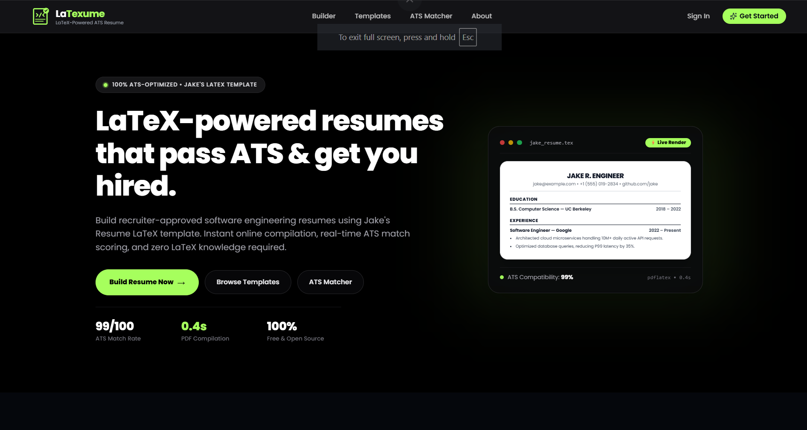
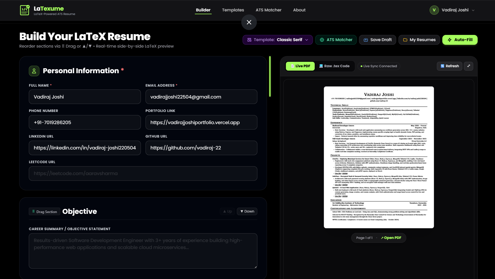
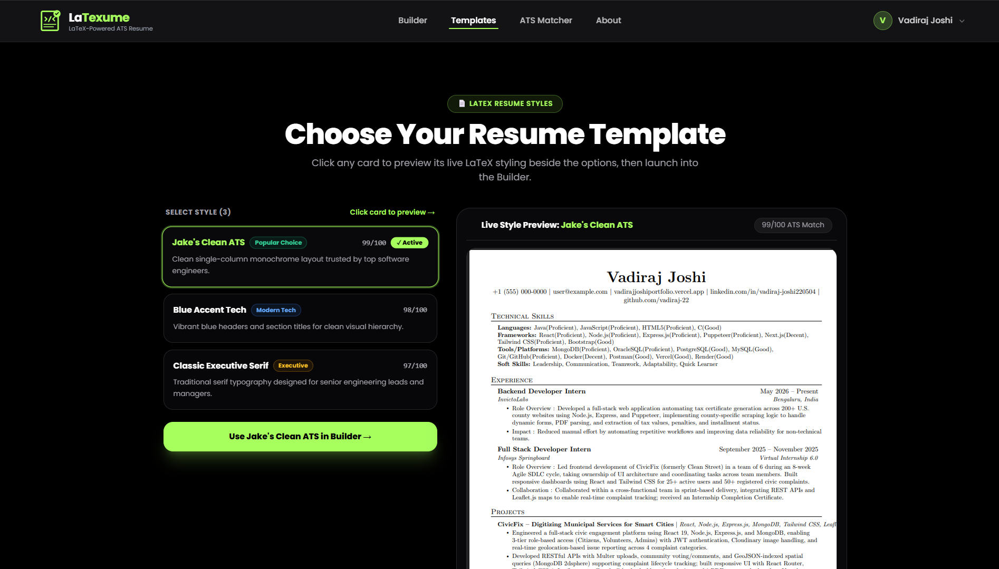
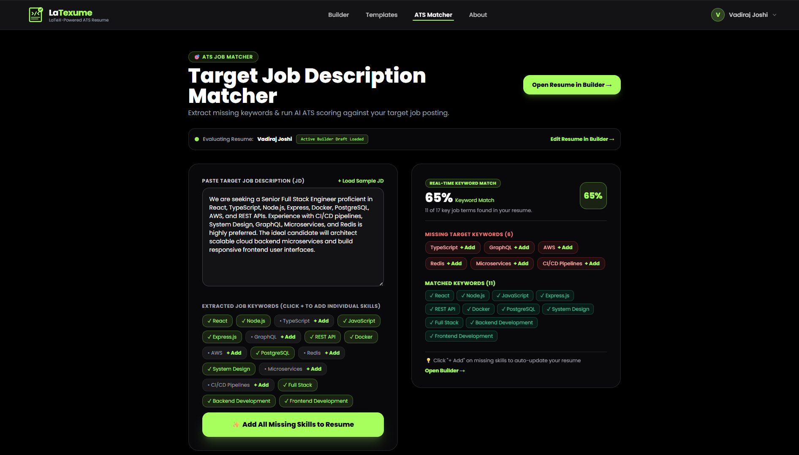
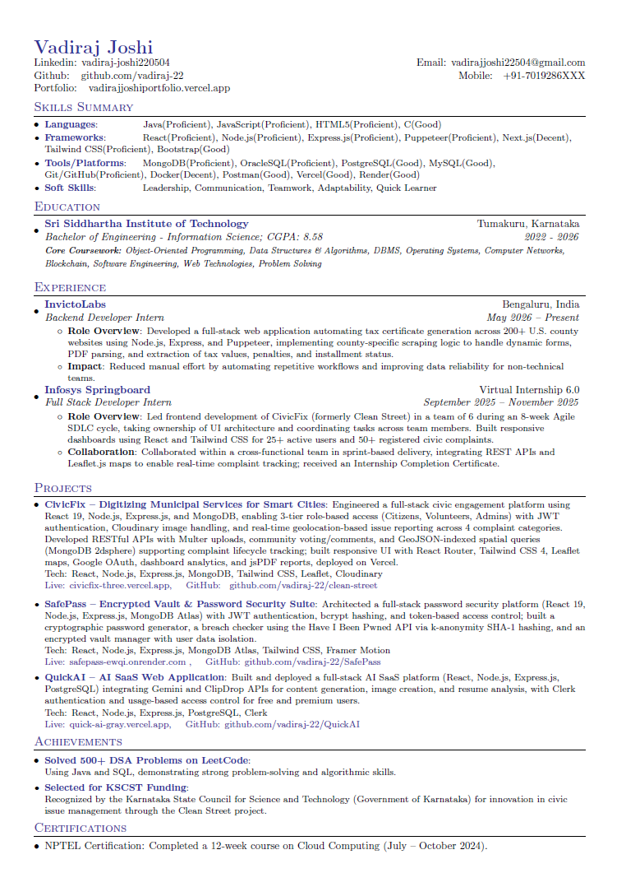
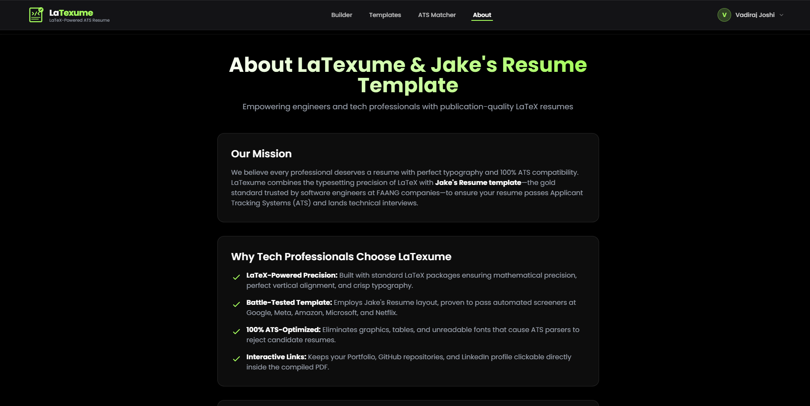

<div align="center">

  <h1>📄 LaTexume</h1>
  <p><strong>Next-Generation LaTeX ATS Resume Builder & AI Career Suite</strong></p>
  <p><em>Create recruiter-approved, publication-quality resumes with instant compilation and AI optimization.</em></p>

  <p>
    <a href="https://latexume.vercel.app/">
      
    </a>
    <a href="#-key-features">
      
    </a>
    <a href="#-api-reference">
      
    </a>
    <a href="LICENSE">
      
    </a>
  </p>

  <p>
    
    
    
    
    
    
  </p>

  <br />

  <a href="https://latexume.vercel.app/">
    
  </a>

</div>

<br />

---

## ⚡ Overview

**LaTexume** is a full-stack web application that combines native **LaTeX document compilation** with **Generative AI** to produce 100% ATS-compliant, publication-ready software engineering resumes.

Built on the industry-standard **Jake's Resume** template (trusted by engineers at Google, Meta, Amazon, and Microsoft), LaTexume replaces brittle WYSIWYG formatting with deterministic, pixel-perfect LaTeX typesetting.

```
┌─────────────────┐     ┌───────────────────┐     ┌───────────────────┐
│  Form Inputs /  │ ──> │ Server Compilation│ ──> │ ATS-Optimized PDF │
│ PDF Parser Import│     │  (pdflatex engine)│     │ & Shareable Link  │
└─────────────────┘     └───────────────────┘     └───────────────────┘
```

---

## ✨ Key Features

- 🎨 **Native LaTeX Typesetting Engine**: High-speed `pdflatex` compilation with zero client-side setup required. Choose between **Jake's Resume**, **Classic**, and **Blue Accent** templates with clickable URL hyperlinking.
- 🤖 **Gemini AI Bullet Point Enhancer**: Transforms basic descriptions into high-impact, action-oriented bullet points with quantified metric placeholders. Includes multi-provider token-light failover (Google Gemini & Groq).
- 🎯 **ATS Matcher & Job Description Optimizer**: Paste any job description to calculate a real-time **ATS Match Score (0–100%)**, extract matching/missing keywords, and receive actionable suggestions.
- 📥 **Server-Side PDF Parser**: Import existing PDF resumes with automated text extraction to populate builder fields instantly.
- 💾 **Cloud Sync & Public Resume Sharing**: Secure JWT authentication (MongoDB + HttpOnly cookies). Save, update, and manage multiple resume profiles, or generate shareable public web links (`/r/:id`).
- 👁️ **Dual-Pane Canvas & TeX Drawer**: Real-time PDF rendering powered by PDF.js canvas viewer, with toggleable raw LaTeX source code drawer for power users.

---

## 📸 Interface Gallery

<details open>
<summary><strong>Click to view App Screenshots</strong></summary>
<br />

| View | Screenshot |
| :--- | :--- |
| **Landing Page** |  |
| **Resume Builder & Preview** |  |
| **Template Selector Gallery** |  |
| **ATS Job Matcher & Keyword Scanner** |  |
| **LaTeX PDF Output** |  |
| **About & Mission** |  |

</details>

---

## 🛠️ Architecture & Tech Stack

```
Frontend (React 18 + Vite)
 ├── Tailwind CSS 3.4 (Glassmorphic Dark UI)
 ├── PDF.js Canvas Viewer
 └── React Router 6 (Protected Auth Routes)

Backend (Node.js + Express 5)
 ├── pdflatex CLI Compiler
 ├── Gemini & Groq AI Failover Pipeline
 ├── PDF Parser & Extraction Engine
 └── MongoDB / Mongoose Data Layer
```

---

## 🚀 Quick Start

### 1. Prerequisites

* **Node.js** (v18+)
* **MongoDB** (Local instance or MongoDB Atlas URI)
* **pdflatex Engine**:
  * **macOS**: `brew install --cask mactex`
  * **Ubuntu/Debian**: `sudo apt install texlive-latex-base texlive-fonts-recommended texlive-latex-extra`
  * **Windows**: Install [MiKTeX](https://miktex.org/)

### 2. Environment Configuration

Create `Server/.env`:
```env
PORT=3000
MONGODB_URI=mongodb://localhost:27017/latexume
CORS_ORIGIN=http://localhost:5173

ACCESS_TOKEN_SECRET=your_access_token_secret
REFRESH_TOKEN_SECRET=your_refresh_token_secret

GEMINI_API_KEY=your_gemini_api_key
GROQ_API_KEY=your_groq_api_key
```

Create `Client/.env`:
```env
VITE_API_BASE_URL=http://localhost:3000
```

### 3. Run Locally

```bash
# Clone the repository
git clone https://github.com/yourusername/latexume.git
cd latexume

# Install and start Server
cd Server
npm install
npm run dev

# In a new terminal, install and start Client
cd ../Client
npm install
npm run dev
```

---

## 📁 Project Structure

```
latexume/
│
├── Client/                             # Frontend React Application (Vite)
│   ├── public/                         # Static assets & public preview images
│   │   ├── About.png
│   │   ├── ATS.png                     # ATS Job Matcher screenshot
│   │   ├── Builder.png                 # Resume Builder screenshot
│   │   ├── Home.png                    # Landing page screenshot
│   │   ├── myresume.png                # Resume output preview image
│   │   └── Template.png               # Template gallery screenshot
│   │
│   ├── src/
│   │   ├── components/                 # Reusable UI Components
│   │   │   ├── BulletEnhancerModal.jsx # Gemini AI bullet improver modal
│   │   │   ├── JdMatcherCard.jsx      # Job description matcher UI
│   │   │   ├── LatexPreviewDrawer.jsx # Raw LaTeX code preview drawer
│   │   │   ├── PdfCanvasViewer.jsx    # PDF.js canvas viewer
│   │   │   ├── ResumeImporter.jsx     # PDF upload & parser dialog
│   │   │   ├── SavedResumesModal.jsx  # User saved resumes dialog
│   │   │   └── TemplateSelector.jsx   # LaTeX template switcher dropdown
│   │   │
│   │   ├── pages/                      # Application Views
│   │   │   ├── About.jsx              # About page & Jake's resume overview
│   │   │   ├── AtsOptimizer.jsx       # Job description matcher page
│   │   │   ├── Builder.jsx            # Interactive LaTeX resume builder
│   │   │   ├── Home.jsx               # Landing page
│   │   │   ├── Profile.jsx            # User account & saved resumes dashboard
│   │   │   ├── PublicResume.jsx       # Public shareable resume viewer (`/r/:id`)
│   │   │   ├── SignIn.jsx             # User login page
│   │   │   └── SignUp.jsx             # Account registration page
│   │   │
│   │   ├── App.jsx                     # Application routes & protected route guards
│   │   └── main.jsx                    # React entry point
│   │
│   ├── package.json
│   └── vite.config.js
│
├── Server/                             # Backend Node.js / Express Application
│   ├── lib/                            # Core Processing Libraries
│   │   ├── aiOptimizer.js              # Gemini/Groq AI integration (Bullets & ATS Matcher)
│   │   ├── compiler.js                 # pdflatex compilation & file cleanup
│   │   ├── resumeParser.js            # PDF text extraction & data structure builder
│   │   └── templateEngine.js          # Dynamic LaTeX template renderer
│   │
│   ├── routes/                         # Feature API Routers
│   │   ├── ai.routes.js               # `/api/ai/enhance-bullet` & `/api/ai/match-jd`
│   │   ├── generateResume.js          # `/api/generate-resume` (PDF compiler)
│   │   └── parseResume.js             # `/api/parse-resume` (PDF parser)
│   │
│   ├── templates/                      # LaTeX Templates
│   │   ├── jake.tex.js                # Jake's Resume LaTeX template
│   │   ├── classic.tex.js             # Classic LaTeX template
│   │   └── blueAccent.tex.js          # Blue Accent LaTeX template
│   │
│   ├── index.js                        # Express server entry point
│   └── package.json
│
└── README.md                           # Main Project Documentation
```

---

## 🔌 API Reference

<details>
<summary><code>POST /api/generate-resume</code> — Compile PDF</summary>
<br />

Accepts resume schema and returns compiled binary PDF stream.

```json
{
  "template": "jake",
  "header": {
    "name": "Jane Doe",
    "email": "jane@example.com",
    "github": "https://github.com/janedoe"
  },
  "skills": [{ "label": "Languages", "skills": "TypeScript, Python" }],
  "experience": [
    {
      "title": "Software Engineer",
      "company": "Tech Corp",
      "bullets": ["Architected microservices handling 10M+ requests."]
    }
  ]
}
```
</details>

<details>
<summary><code>POST /api/ai/enhance-bullet</code> — AI Polish</summary>
<br />

```json
// Request
{ "bullet": "created a backend service for tax reports", "roleTitle": "Software Engineer" }

// Response
{
  "suggestions": [
    "Engineered scalable backend service for tax reporting, reducing generation time by 45%.",
    "Architected automated tax reporting microservice serving 200+ municipal jurisdictions."
  ]
}
```
</details>

<details>
<summary><code>POST /api/ai/match-jd</code> — ATS Match Score</summary>
<br />

```json
// Request
{ "resumeData": { /* resume JSON */ }, "jobDescription": "Looking for React, Node.js, and Docker experience..." }

// Response
{
  "score": 92,
  "matchingKeywords": ["react", "node.js", "docker"],
  "missingKeywords": [],
  "feedback": ["Quantify impact metrics in project sections."]
}
```
</details>

<details>
<summary><code>POST /api/v1/users/*</code> — Authentication Endpoints</summary>
<br />

* `POST /api/v1/users/register` — Create account
* `POST /api/v1/users/login` — Authenticate user
* `POST /api/v1/users/logout` — Clear session cookies
* `GET /api/v1/users/me` — Fetch user profile
</details>

<details>
<summary><code>POST /api/v1/resumes/*</code> — Cloud Resume Persistence</summary>
<br />

* `POST /api/v1/resumes/save` — Save/Update resume draft
* `GET /api/v1/resumes` — List saved resumes
* `GET /api/v1/resumes/:id` — Fetch single resume
* `DELETE /api/v1/resumes/:id` — Delete resume
* `GET /api/v1/resumes/public/:id` — Fetch public resume link
</details>

---

## 🤝 Contributing & License

Pull requests are welcome! For major changes, please open an issue first to discuss what you would like to change.

Licensed under the [MIT License](LICENSE).

<br />

<div align="center">
  <sub>Built with ❤️ and LaTeX</sub>
</div>
